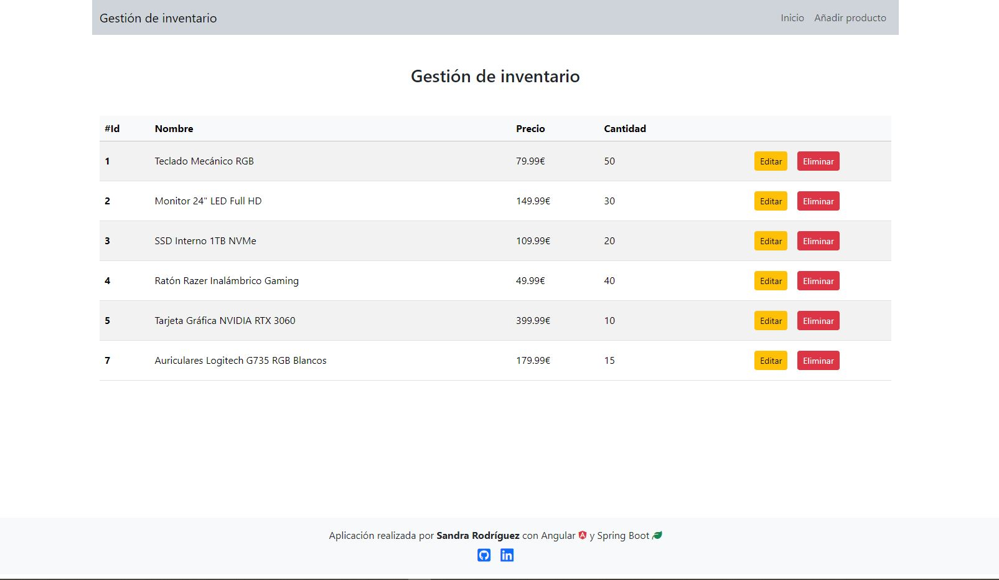

# Sistema de gestión de inventario (Frontend)

## Descripción

Este es un sistema de gestión de inventario que permite realizar operaciones CRUD (Crear, Leer, Actualizar y Eliminar) sobre los registros de productos. La aplicación utiliza **Angular**, **TypeScript** y **Bootstrap** para el frontend, y **Spring Boot** con **MySQL** para el backend.

## Características

- **Listado de productos**: Muestra una lista completa de todos los productos.
- **Agregar producto**: Posibilidad de añadir nuevos productos al sistema.
- **Editar producto**: Permite modificar la información de un producto específico.
- **Eliminar producto**: Opción para eliminar un producto del sistema.

## Tecnologías Utilizadas

- **Frontend**:
  - Angular
  - TypeScript
  - Bootstrap
- **Backend**:
  - Spring Boot
  - MySQL

## ✨ Autor

- [GitHub de Sandra](https://github.com/srdgz)
- [LinkedIn de Sandra](https://www.linkedin.com/in/sandra-rodriguez-reyes/)
